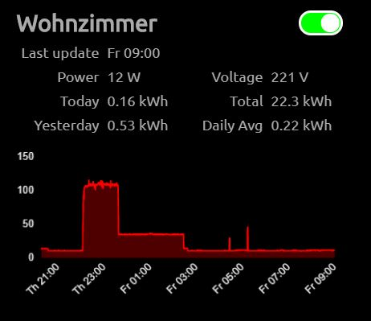

# MMM-Tasmota



This is a module for the [MagicMirror²](https://github.com/MichMich/MagicMirror/) that displays controls and (optional) power stats of your Tasmota devices. The module needs an MQTT broker.


## Features
 * Touch Support
 * Support for power stats

## Installing

### Step 1 - Install the module

```javascript
cd ~/MagicMirror/modules
git clone https://github.com/lavolp3/MMM-Tasmota.git
cd MMM-Tasmota
npm install
```

### Step 2 - Add module to `MagicMirror/config/config.js`
Add this configuration to `config.js`

```javascript
{
    module: "MMM-Tasmota",
    position: "top_left",
    config: {
        host: 'http://localhost:8033',
        updateInterval: 60 * 1000,
        devices: [
            {
              //YOUR DEVICE HERE, see "Device config" instructions below
            }
        ],
        chartxAxisFormat: "dd HH:mm",
    }
},
```
## Configuration

Here is the configurable part of the module

 Option               | Type            | Description 
 -------------------- | --------------- | ----------- 
 `host`               | string          | **Required** Address of your MQTT broker including the port number.<br>*Default value:* `'http://localhost:8033'` 
 `devices`            | array of objects| **Required** Devices array (see options below). 
 `updateInterval`     | integer         | Update interval for chart and values. <br> *Default value:*  `60*1000`
 `chartxAxisFormat`   | string          | Moment.js format of the x Axis labels. See Moment.js docs for formatting options<br>*Default value: `'dd HH:mm'`
 `topicWidth`         | integer         | width of the topic window(s). The container design is flexible so you can choose to put topics in one line.<br> *Default value:* `400`
 `showUnits`          | boolean         | Show units in table<br> *Default value:* `true`
 `debug`              | boolean         | Activate for additional debug output to console and web console<br> *Default value:* `false`

### Device configs

The configs to use for every device:

| Option               | Type            | Description
|--------------------- |-----------------|-----------
| `topic`              | string          | **Required** Topic description as sent by the device.
| `name`               | string          | **Optional** Shown name of the device.
| `showPowerStats`     | boolean         | **Optional** Show or hide power stats of your Tasmota device<br> *Default value:* `false` 
| `teleInterval`       | integer         | **Optional** Telemetry Interval (in seconds) as set in the devices config. Only for calculation purposes!<br>*Default value:* `300`
| `chartInterval`      | integer         | **Optional** The interval (in hours) shown in the chart.<br>*Default value:* `24`
| `chartColor`         | string          | **Optional** Color of the chart.<br> You can use 'red', 'green', 'blue', 'yellow', 'white'. The color is hardcoded so hex codes or rgba codes will default to red.<br> *Default value:* `red`


## Updating
Go to the module’s folder inside MagicMirror modules folder and pull the latest version from GitHub and install:
```
git pull
npm install
```